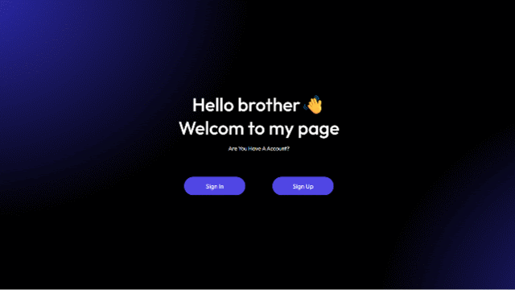

# MERN Authentication System

A robust backend authentication system built with the MERN stack. Features secure User Management, JWT-based sessions, and OTP verification for enhanced security. Designed with protected routes and password hashing to ensure industry-standard safety.



A complete authentication system with:
- User registration with email
- User Login
- Email OTP verification
- Secure login with JWT
- Protected routes
- Password hashing

## Tech Stack


## Features
- Secure user registration
- Login with email & password
- OTP verification via email
- Protected routes using JWT

## Demo Video
[](https://drive.google.com/file/d/1sOHZO_T1gREbBMmAgJVAnOIlxW2louMo/view?usp=drive_link)

*Click the image above to watch the full demo on Google Drive.*
- User registration
- OTP received on email
- OTP verification
- Login
- Accessing protected routes

## Project Structure
```text
auth-system/
├── backend/                # Server-side logic & API
│   ├── controllers/        # Business logic for routes
│   ├── models/             # MongoDB schemas (User, etc.)
│   ├── routes/             # API endpoints
│   ├── middleware/         # Auth & Error handling
│   └── server.js           # Main entry point
├── frontend/               # Client-side UI (React/JS)
│   ├── src/                # Component & Logic files
│   └── index.html          # Main HTML entry
├── .env.example            # Sample environment variables
├── .gitignore              # Git ignore file
├── README.md               # Project documentation
└── package.json            # Dependencies & Scripts
```

## 📦 Getting Started

To get a local copy of this project up and running, follow these steps.

### 🚀 Prerequisites

- **Node.js** (v24.13.0 or higher) and **npm**.
- **Npm** If you prefer using npm for package management and running scripts.
- **MongoDB** (or another supported NonSQL database).

## 🛠️ Installation

1. **Clone the repository:**

   ```bash
   git clone https://github.com/dev-awais-maqbool/MERN-Auth-System.git
   cd readme-template
   ```

2. **Install dependencies:**

   Using Npm:

   ```bash
   npm install
   ```

3. **Set up environment variables:**

   Create a `.env` file in the root directory and add the following variables:

   ```env
   PORT= your_port
   MONGO_URI= your_database_link
   JWT_SECRET="your_secret_code"
   NODE_ENV=development  # NODE_ENV=production
   SMTP_USER= your_smtp_userId
   SMTP_PASS= your_smtp_password
   SENDER_EMAIL= sender_email
   ```
4. **Start the development server:**

   ```start
   node server.js
   ```
## Security Notes

- Passwords are hashed before saving
- JWT is used for authentication
- Sensitive data is stored in .env file

## Author  
Awais Maqbool -Full Stack Developer (MERN)